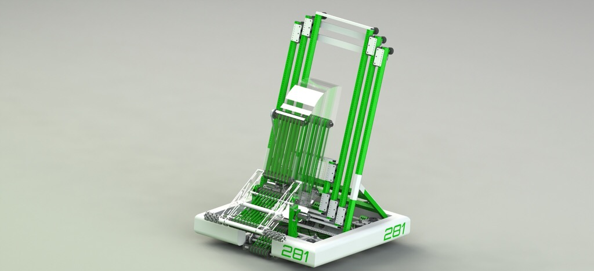
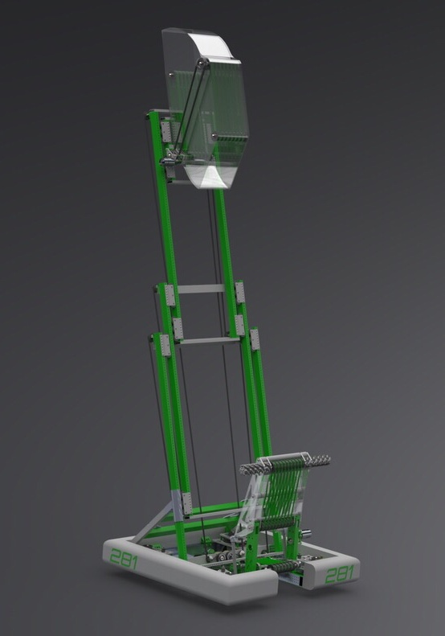
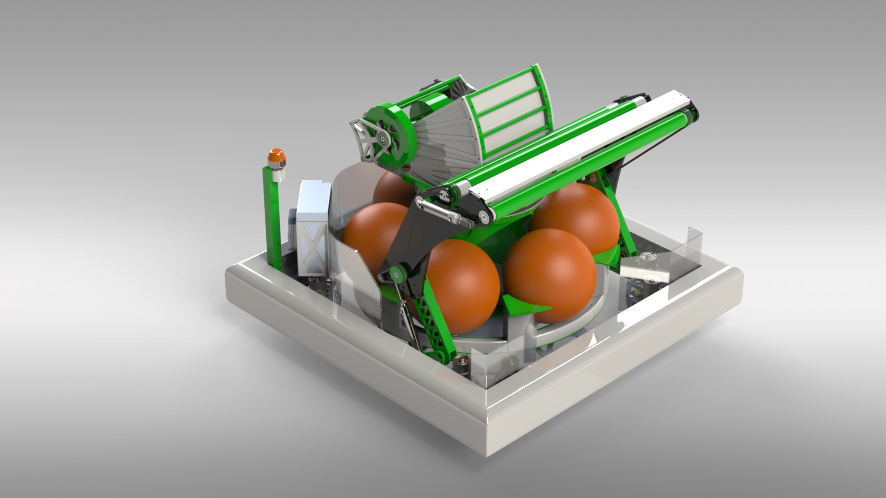
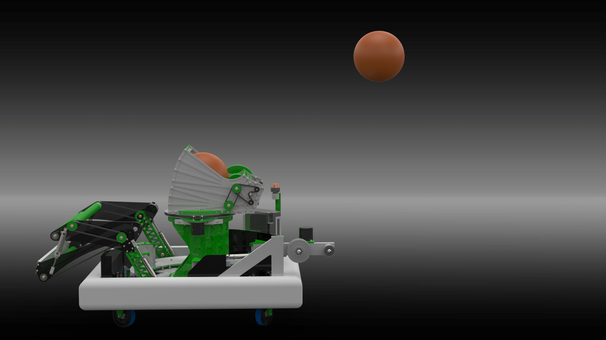
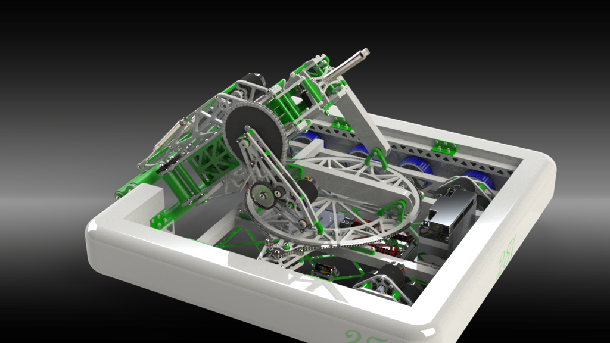
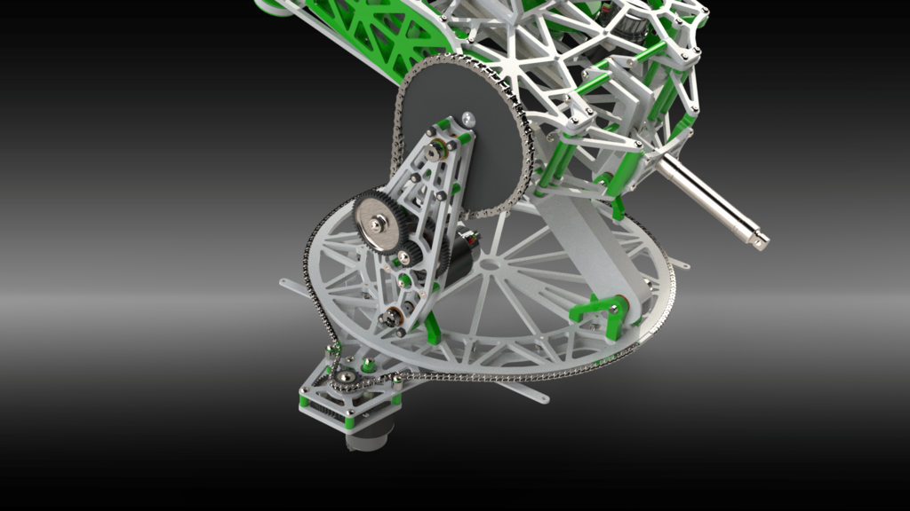
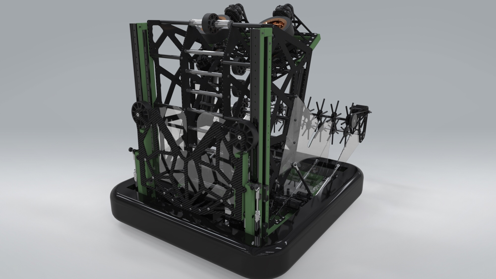

## CAD competition entries

* * *

This is the first robot we designed, which featured a roller-based ball collection system and an linear-motion elvator to deliver the balls. I designed the intake system and elevator power transmission.

The next competition featured similar concepts, but involved a smaller design with a rotary ball indexer and a turret system to shoot balls into a goal. I designed the turret and intake system.

The third robot we designed was intended to pick up large discs and fire them using a turret system. I designed the pickup/turret/firing system.

The final robot I worked on was intended to pick up a large number of footballs and fire them out, in addition to picking up and depositing large thin donut-shaped discs. I designed the flywheel-based indexing and firing mechanism, intended to fire the footballs and give them controllable spin.

  

