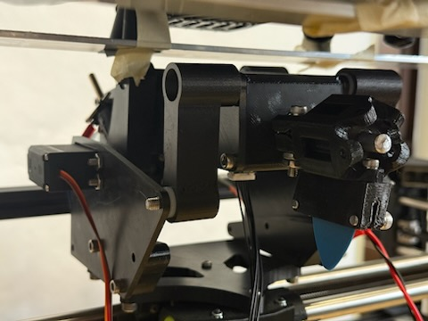
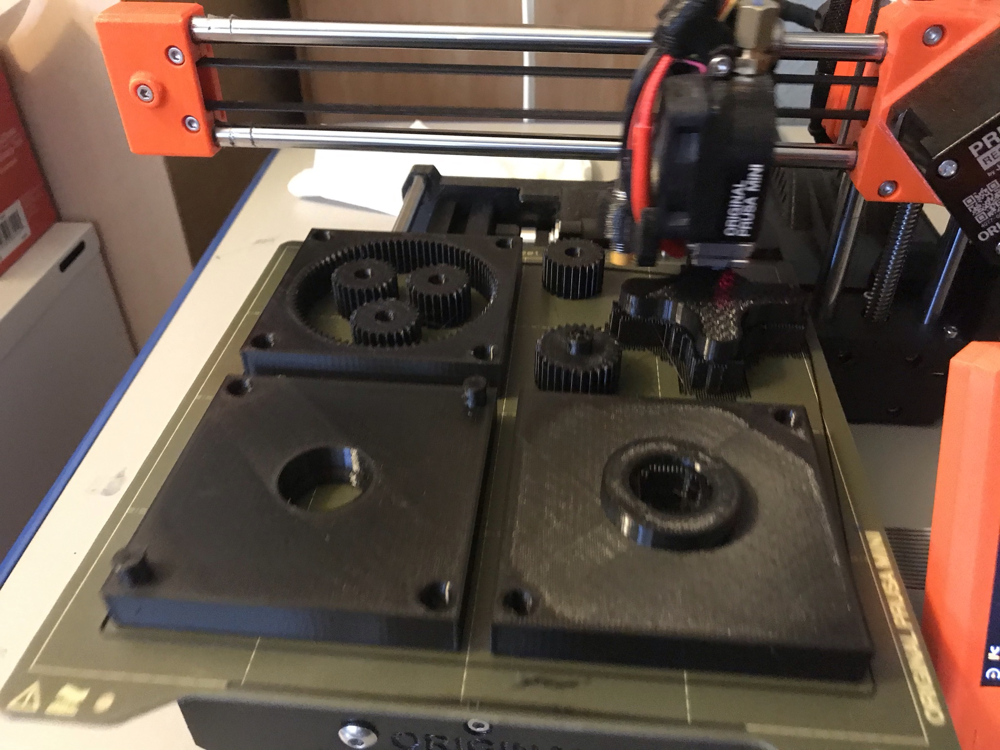
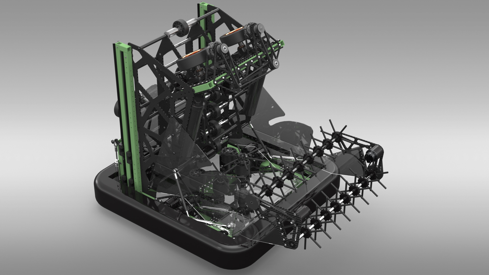

## Projects:
* * *

  

    
<strong>Guitar testing robot</strong>

    
  

  

    
<strong>Freelance and personal projects</strong>

    
  

  

    
<strong>High school robotics</strong>

    
  

  

    
<strong>CAD competitions</strong>

    
  

