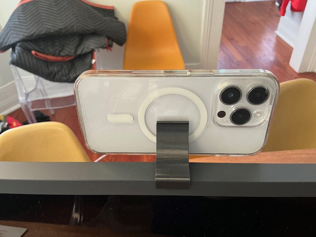
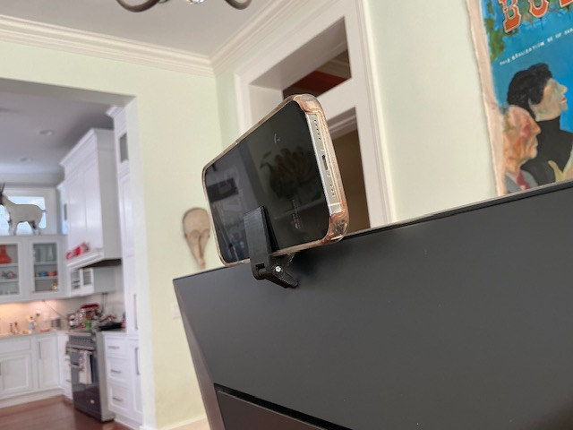
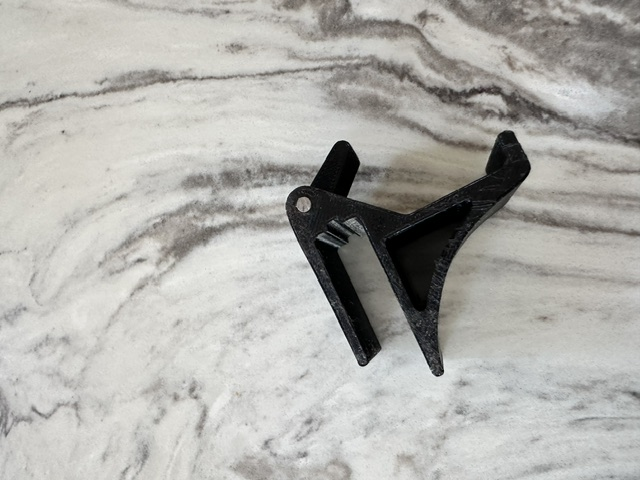
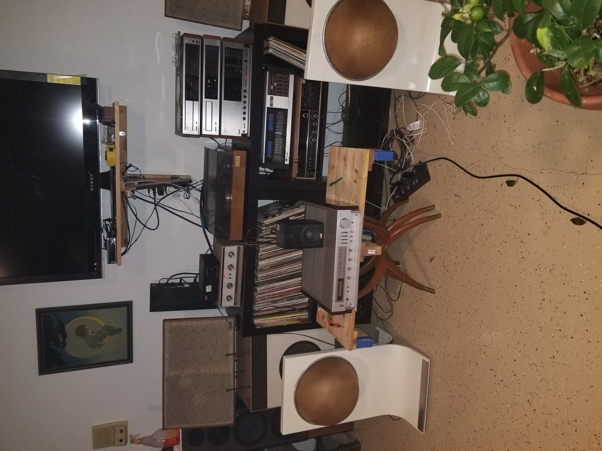
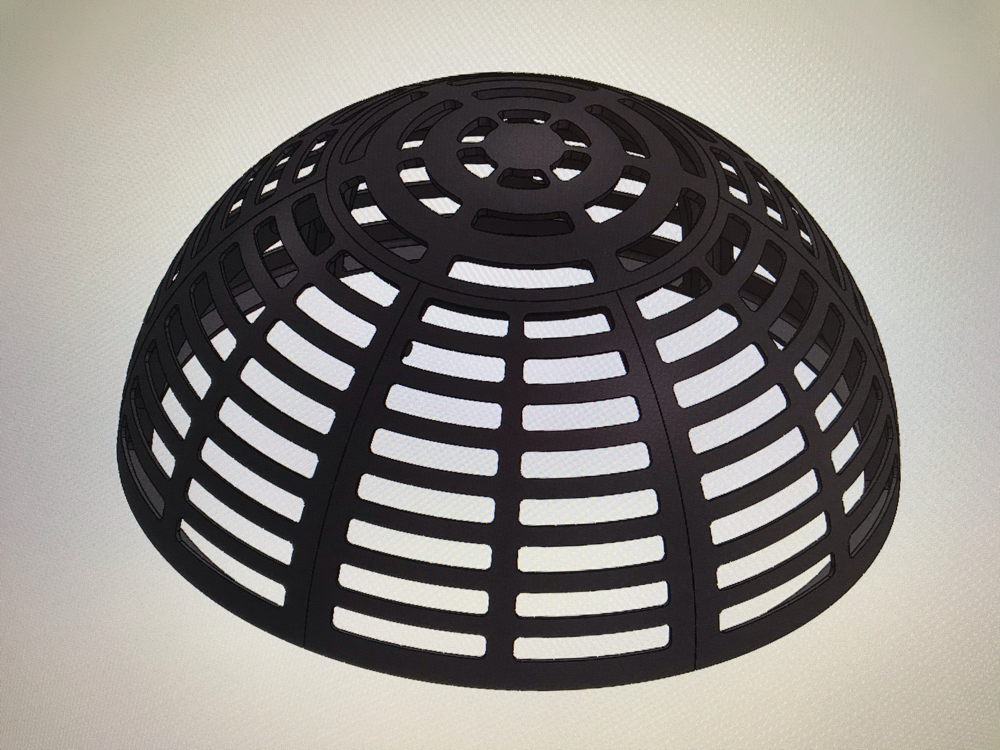
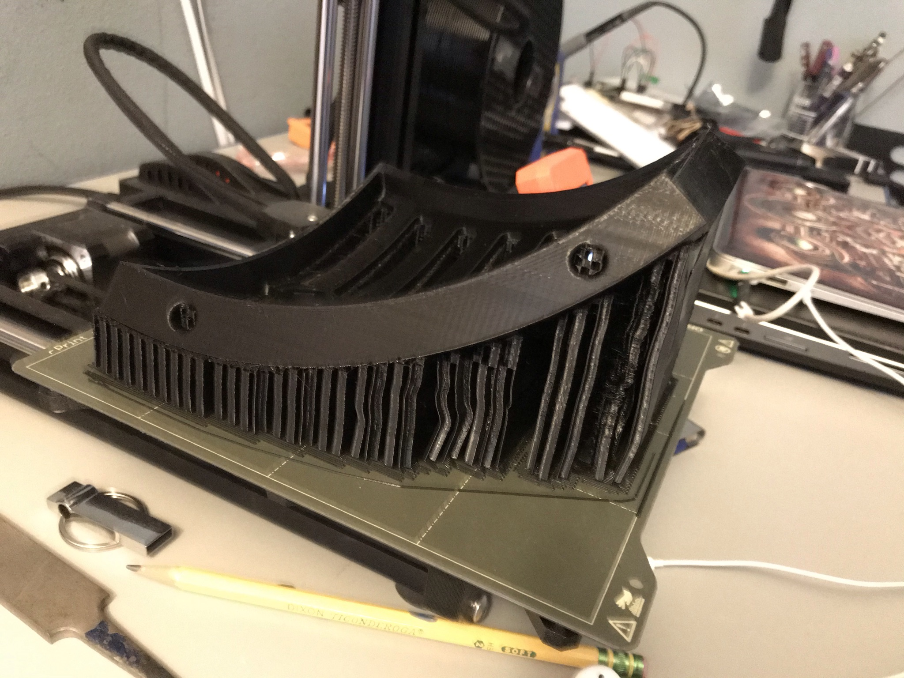
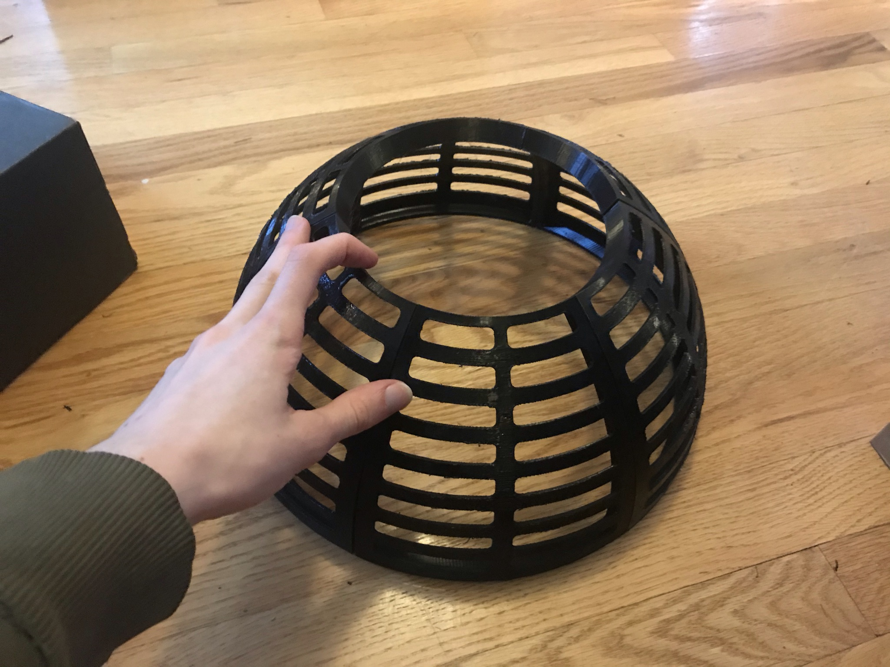
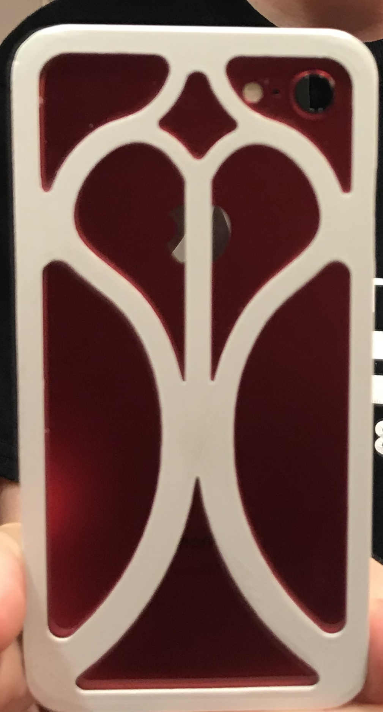
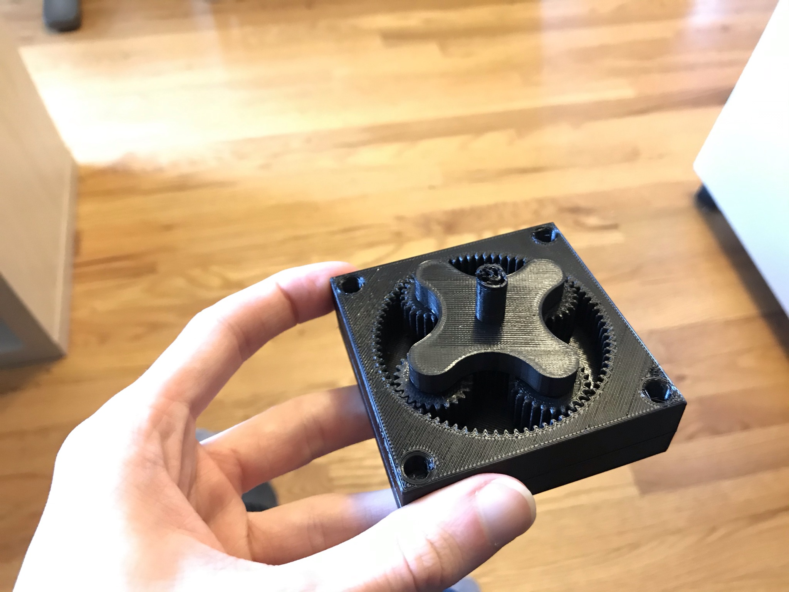

## Independent projects

 * * *
### Phone-as-webcam mount for any monitor size
Most smartphones can double as a webcam for video conferencing, which gives excellent video quality and eliminates the need for more peripherals. I designed a mount for an iPhone that could interface with a variety of monitors thanks to an adjustable leg.

### Hemispherical speaker housing
A local connection I had needed to repair a set of unusually-shaped speaker housings, which essentially use a piece of fabric stretched over a colander-like structure to cover the actual speaker drivers. I designed new structures that could be easily printed using my prusa mini while still retaining the original shape.

### Misc projects

A custom 3D printed phone case:

A 3D printed orbital gearbox, to understand how 3D printing tolerances affect gear mesh & tooth profiles:

  

